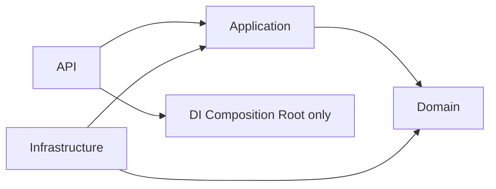
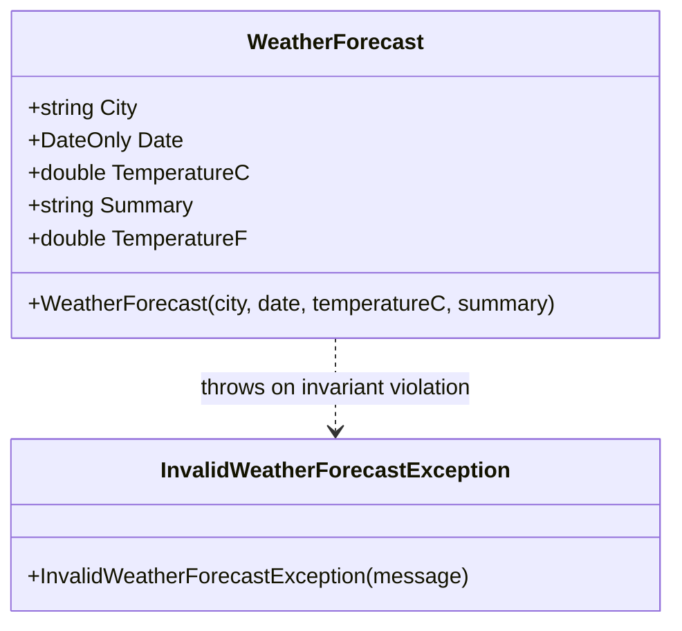

# Get Weather Forecast by City

**Status**: Draft
**Created**: 2026-10-05
**Author**: spec-writer agent
**Related Stories**: [docs/user-stories/get-weather-forecast-by-city-user-story.md](../user-stories/get-weather-forecast-by-city-user-story.md)

## Executive Summary

This feature exposes a single read-only endpoint that returns the current weather forecast for a given city name. It is implemented as a MediatR Query (`GetWeatherForecastByCityQuery`) handled in the Application layer, which delegates data retrieval to an `IWeatherForecastProvider` abstraction. The Infrastructure layer supplies an in-memory/mock implementation of that provider — no external HTTP calls and no EF Core/persistence are involved. The Domain layer owns a `WeatherForecast` entity that encapsulates the temperature/unit conversion business rule (Celsius → Fahrenheit) and basic invariants, ensuring the Application layer never leaks domain types to the API by projecting to a `WeatherForecastDto`.

## Technical Analysis

### Affected Layers

- **Domain (`DevNews.Service.Domain`)**:
  - New entity `WeatherForecast` (City, Date, TemperatureC, Summary; computed `TemperatureF`).
  - New domain exception `InvalidWeatherForecastException` (thrown when invariants are violated when constructing the entity, e.g. empty city or temperature below absolute zero).
  - No Domain Events required (no persistence, no state transition to broadcast).

- **Application (`DevNews.Services.Application`)**:
  - New query `GetWeatherForecastByCityQuery` (city: string) returning `WeatherForecastDto`.
  - New handler `GetWeatherForecastByCityQueryHandler`.
  - New DTO `WeatherForecastDto` (City, TemperatureC, TemperatureF, Summary, Date).
  - New FluentValidation validator `GetWeatherForecastByCityQueryValidator` (required, max length, allowed characters, trims whitespace).
  - New provider abstraction `IWeatherForecastProvider` (interface owned by Application, implemented by Infrastructure).
  - New Application-level exceptions: `CityNotFoundException` (maps to 404), `WeatherProviderUnavailableException` (maps to 503).

- **Infrastructure (`DevNews.Service.Infrastructure`)**:
  - New class `MockWeatherForecastProvider : IWeatherForecastProvider` — an in-memory/mock data source keyed by normalized city name, with a fixed seed list of supported cities (e.g., Seattle, London, Tokyo, Sydney, Cairo).
  - DI registration extension (e.g., `AddWeatherInfrastructure(this IServiceCollection services)`) to register `IWeatherForecastProvider`.
  - No EF Core `DbContext` changes, no entity configurations, no migrations required for this feature.

- **API (`DevNews.Service`)**:
  - New controller `WeatherController` (or Minimal API endpoint group) exposing `GET /api/weather/{city}`, routing to MediatR via `ISender`/`IMediator`.
  - Global exception-handling middleware (or a mapping filter) translates Application exceptions to `ProblemDetails` with the correct status codes (400 / 404 / 503 / 500).
  - No authorization policy required (anonymous access), consistent with the user story's security notes. If a global `[Authorize]` policy exists project-wide, this endpoint must be explicitly annotated `[AllowAnonymous]` to preserve the documented contract.

### Affected Layers — Dependency Direction



The API layer composes DI (registering `MockWeatherForecastProvider` against `IWeatherForecastProvider`) but has no compile-time dependency on Infrastructure types beyond the composition root (`Program.cs`).

## API Contract

```yaml
paths:
  /api/weather/{city}:
    get:
      summary: Get the current weather forecast for a city
      operationId: getWeatherForecastByCity
      tags:
        - Weather
      parameters:
        - name: city
          in: path
          required: true
          description: >
            The name of the city to retrieve the current weather forecast for.
            Leading/trailing whitespace is trimmed. Max length 100 characters.
            Must contain only letters, spaces, hyphens, apostrophes, and periods
            (e.g., "Seattle", "St. Louis", "Winston-Salem").
          schema:
            type: string
            maxLength: 100
            example: Seattle
      responses:
        '200':
          description: Weather forecast retrieved successfully
          content:
            application/json:
              schema:
                $ref: '#/components/schemas/WeatherForecastDto'
        '400':
          description: Validation error — city missing, empty, too long, or contains invalid characters
          content:
            application/problem+json:
              schema:
                $ref: '#/components/schemas/ProblemDetails'
        '404':
          description: No forecast data available for the specified city
          content:
            application/problem+json:
              schema:
                $ref: '#/components/schemas/ProblemDetails'
        '500':
          description: Unexpected internal server error
          content:
            application/problem+json:
              schema:
                $ref: '#/components/schemas/ProblemDetails'
        '503':
          description: Underlying weather data source is temporarily unavailable
          content:
            application/problem+json:
              schema:
                $ref: '#/components/schemas/ProblemDetails'

components:
  schemas:
    WeatherForecastDto:
      type: object
      required:
        - city
        - temperatureC
        - temperatureF
        - summary
        - date
      properties:
        city:
          type: string
          example: Seattle
        temperatureC:
          type: number
          format: double
          description: Current temperature in degrees Celsius
          example: 18.5
        temperatureF:
          type: number
          format: double
          description: Current temperature in degrees Fahrenheit (computed from Celsius)
          example: 65.3
        summary:
          type: string
          description: Short weather condition text
          example: Cloudy
        date:
          type: string
          format: date
          description: The date the forecast pertains to (UTC date, no time component)
          example: "2026-10-05"
    ProblemDetails:
      type: object
      properties:
        type:
          type: string
        title:
          type: string
        status:
          type: integer
        detail:
          type: string
        instance:
          type: string
```

### HTTP Status Code Summary

| Status | Condition | Source |
|---|---|---|
| `200 OK` | Valid, recognized city; forecast returned | Handler success path |
| `400 Bad Request` | City missing/empty/whitespace, exceeds max length, or contains invalid characters | FluentValidation pipeline behavior (MediatR) |
| `404 Not Found` | City is syntactically valid but not recognized by the provider | `CityNotFoundException` → exception-handling middleware |
| `503 Service Unavailable` | Provider throws a transient/availability failure | `WeatherProviderUnavailableException` → exception-handling middleware |
| `500 Internal Server Error` | Any unhandled exception | Global fallback exception handler |

Error responses never include stack traces, exception messages from internals, or provider-specific diagnostics in `detail`; only a generic, safe message is surfaced.

## Domain Architecture (`DevNews.Service.Domain`)

### Entity Relationship



### Entity Design — `WeatherForecast`

| Property | Type | Constraints / Attributes |
|---|---|---|
| `City` | `string` | Required, non-empty, trimmed, max 100 chars (validated by caller before construction; entity also guards against empty/whitespace) |
| `Date` | `DateOnly` | Required; represents the date the forecast pertains to |
| `TemperatureC` | `double` | Required; must be ≥ `-273.15` (absolute zero) |
| `Summary` | `string` | Required, non-empty short text (e.g., "Sunny", "Rain") |
| `TemperatureF` | `double` (computed, read-only) | Derived as `(TemperatureC * 9 / 5) + 32`; not settable directly |

### Domain Behavior

- The entity is constructed only via a constructor (or static factory `WeatherForecast.Create(...)`) that validates:
  - `City` is not null/empty/whitespace → otherwise throws `InvalidWeatherForecastException("City is required.")`.
  - `TemperatureC` is not below absolute zero (`-273.15`) → otherwise throws `InvalidWeatherForecastException("Temperature cannot be below absolute zero.")`.
  - `Summary` is not null/empty/whitespace → otherwise throws `InvalidWeatherForecastException("Summary is required.")`.
- `TemperatureF` is a computed property with no public setter — it is always derived from `TemperatureC`, guaranteeing the two values can never be inconsistent.
- The entity is immutable after construction (no public setters); this is a value-like entity since it is never persisted or looked up by identity — it does not need an `Id`/`Guid` primary key for this minimal scope.

### Domain Exceptions

- `InvalidWeatherForecastException : Exception` — thrown by the `WeatherForecast` constructor/factory when invariants listed above are violated. This is a safety net; the primary validation (city format/length) happens in the Application layer's FluentValidation validator before the query even reaches the handler, so this exception is expected to be rare (e.g., only triggered by malformed provider data).

## Application Layer & CQRS (`DevNews.Services.Application`)

### Queries (Read-Only)

- **Name**: `GetWeatherForecastByCityQuery`
- **Properties**:
  - `City` (`string`) — the raw city name as supplied by the API route parameter.
- **Return Type**: `WeatherForecastDto`
- **Validation** (`GetWeatherForecastByCityQueryValidator : AbstractValidator<GetWeatherForecastByCityQuery>`):
  - `RuleFor(x => x.City).NotEmpty().WithMessage("City name is required.")`
  - `RuleFor(x => x.City).MaximumLength(100).WithMessage("City name must not exceed 100 characters.")`
  - `RuleFor(x => x.City).Matches(@"^[\p{L} .'-]+$").WithMessage("City name contains invalid characters.")` (applied after trimming; allows letters/unicode letters, spaces, periods, apostrophes, hyphens — rejects digits/control characters/symbols)
  - Validation runs via a shared MediatR `ValidationBehavior<TRequest, TResponse>` pipeline behavior that short-circuits and surfaces a `ValidationException`, mapped to `400 Bad Request` with a `ProblemDetails` body by the API layer.
- **Handler Logic** (`GetWeatherForecastByCityQueryHandler : IRequestHandler<GetWeatherForecastByCityQuery, WeatherForecastDto>`):
  1. Normalize the city name: `Trim()` the input (already guaranteed non-empty/valid by the validator).
  2. Call `IWeatherForecastProvider.GetForecastAsync(normalizedCity, cancellationToken)` exactly once (no redundant/repeated calls within the request).
  3. If the provider returns `null` (city not recognized), throw `CityNotFoundException($"No forecast data available for city '{city}'.")`.
  4. If the provider throws a transient/availability exception, let it propagate as `WeatherProviderUnavailableException` (the provider implementation is responsible for wrapping/translating low-level failures into this Application-level exception type so Infrastructure details never leak).
  5. Construct/obtain the Domain `WeatherForecast` entity (either returned directly by the provider or constructed in the handler from primitive data returned by the provider) and project it to `WeatherForecastDto` via a `static` mapping method or AutoMapper `ProjectTo`-style explicit mapping (no AutoMapper dependency is required given the minimal shape — manual mapping is acceptable and preferred to keep this Infrastructure-free).
  - The entire handler method is `async` and threads the incoming `CancellationToken` through to `IWeatherForecastProvider.GetForecastAsync`.

### DTOs

- **`WeatherForecastDto`** (record or class, Application layer, API-facing shape):

  | Property | Type |
  |---|---|
  | `City` | `string` |
  | `TemperatureC` | `double` |
  | `TemperatureF` | `double` |
  | `Summary` | `string` |
  | `Date` | `DateOnly` |

  The Domain entity is never returned directly from the handler — the DTO is the only type that crosses the Application → API boundary for this query.

### Application-Level Exceptions

- **`CityNotFoundException`** — thrown by the handler when the provider has no data for the requested city. Maps to `404 Not Found`.
- **`WeatherProviderUnavailableException`** — thrown/propagated when the provider cannot currently supply data. Maps to `503 Service Unavailable`.

### Provider Abstraction (owned by Application, implemented by Infrastructure)

```csharp
public interface IWeatherForecastProvider
{
    Task<WeatherForecast?> GetForecastAsync(string city, CancellationToken cancellationToken);
}
```

- Returns `null` when the city is not recognized (handler translates this to `CityNotFoundException`).
- Throws `WeatherProviderUnavailableException` when the data source cannot be reached/queried (the mock implementation may simulate this for testing purposes but does not do so by default).
- Returns a Domain `WeatherForecast` entity (constructed internally by the Infrastructure implementation), keeping entity construction co-located with the layer that owns the raw/seed data.

## Infrastructure Layer (`DevNews.Service.Infrastructure`)

- **`MockWeatherForecastProvider : IWeatherForecastProvider`**:
  - Holds an in-memory, read-only seed dictionary keyed by a normalized (lower-invariant, trimmed) city name, mapping to a fixed `WeatherForecast` snapshot (or to the raw values needed to construct one on each call, using `DateOnly.FromDateTime(DateTimeOffset.UtcNow.UtcDateTime)` as `Date` so the forecast date reflects "today" on every call).
  - Example seed set: Seattle, London, Tokyo, Sydney, Cairo — each with a fixed `TemperatureC` and `Summary` for deterministic test behavior.
  - `GetForecastAsync` performs an in-memory dictionary lookup (`O(1)`, no I/O, no blocking calls) and returns `Task.FromResult<WeatherForecast?>(...)`.
  - No `DbContext`, no `IEntityTypeConfiguration<T>`, no migrations — this feature has zero persistence footprint.
  - No external HTTP client is used for this minimal scope; if a future iteration swaps in a real weather API, it would implement the same `IWeatherForecastProvider` interface behind an `HttpClient`-based class registered via `IHttpClientFactory`, without any change to the Application or API layers.
- **DI Registration**: an `IServiceCollection` extension method (e.g., `AddWeatherInfrastructure`) in Infrastructure registers `IWeatherForecastProvider` → `MockWeatherForecastProvider` as a singleton (safe, since the mock data is immutable and stateless per call).

## Performance & Green Code Considerations

- **Single provider call per request**: the handler calls `IWeatherForecastProvider.GetForecastAsync` exactly once — no redundant/repeated fetches within the request lifecycle.
- **No collection/pagination concerns**: the endpoint returns a single object, not a list, so no pagination, `Skip`/`Take`, or max-page-size rules apply.
- **Async all the way down**: the controller action, MediatR handler, and provider method are all `async` and accept/forward a `CancellationToken` sourced from `HttpContext.RequestAborted`.
- **No tracking / no EF Core overhead**: this feature has no database interaction at all, eliminating any `AsNoTracking()` concerns — the in-memory dictionary lookup is O(1) and allocation-light.
- **No blocking I/O**: the mock provider does not simulate network latency or perform synchronous blocking calls; `Task.FromResult` is used for the completed, already-available result.
- **Safe error messages**: `ProblemDetails.Detail` for 404/503/500 responses contains only generic, pre-defined messages — never raw exception messages, stack traces, or provider implementation details, minimizing both security risk and unnecessary response payload size.

## Testing Requirements (`DevNews.Service.Tests`)

### Domain Tests

- [ ] `GivenEmptyCity_WhenWeatherForecastCreated_ThenThrowsInvalidWeatherForecastException`
- [ ] `GivenTemperatureBelowAbsoluteZero_WhenWeatherForecastCreated_ThenThrowsInvalidWeatherForecastException`
- [ ] `GivenEmptySummary_WhenWeatherForecastCreated_ThenThrowsInvalidWeatherForecastException`
- [ ] `GivenValidTemperatureC_WhenTemperatureFComputed_ThenReturnsCorrectFahrenheitConversion`
- [ ] `GivenValidInputs_WhenWeatherForecastCreated_ThenPropertiesAreSetCorrectly`

### Application Tests (Validator)

- [ ] `GivenEmptyOrWhitespaceCity_WhenValidated_ThenFluentValidationFails`
- [ ] `GivenCityExceedingMaxLength_WhenValidated_ThenFluentValidationFails`
- [ ] `GivenCityWithInvalidCharacters_WhenValidated_ThenFluentValidationFails`
- [ ] `GivenValidCityName_WhenValidated_ThenFluentValidationSucceeds`
- [ ] `GivenCityWithLeadingOrTrailingWhitespace_WhenValidated_ThenValidationSucceedsAfterTrim`

### Application Tests (Handler)

- [ ] `GivenRecognizedCity_WhenQueryHandled_ThenReturnsWeatherForecastDtoWithExpectedShape`
- [ ] `GivenUnrecognizedCity_WhenQueryHandled_ThenThrowsCityNotFoundException`
- [ ] `GivenProviderThrowsUnavailableException_WhenQueryHandled_ThenExceptionPropagatesAsWeatherProviderUnavailableException`
- [ ] `GivenValidQuery_WhenHandled_ThenProviderIsCalledExactlyOnce`
- [ ] `GivenCancellationRequested_WhenQueryHandled_ThenCancellationTokenIsHonored`

### API Tests

- [ ] `GivenExistingCity_WhenGetWeatherEndpointCalled_ThenReturns200WithExpectedJsonShape`
- [ ] `GivenMissingOrEmptyCity_WhenGetWeatherEndpointCalled_ThenReturns400WithProblemDetails`
- [ ] `GivenCityExceedingMaxLengthOrInvalidCharacters_WhenGetWeatherEndpointCalled_ThenReturns400WithProblemDetails`
- [ ] `GivenUnrecognizedCity_WhenGetWeatherEndpointCalled_ThenReturns404WithProblemDetails`
- [ ] `GivenProviderUnavailable_WhenGetWeatherEndpointCalled_ThenReturns503WithProblemDetailsAndNoLeakedInternals`
- [ ] `GivenUnhandledException_WhenGetWeatherEndpointCalled_ThenReturns500WithGenericProblemDetails`

## Quality Standards Checklist

- [x] Domain layer has no data-access or HTTP concerns — `WeatherForecast` is a pure, immutable entity with constructor-enforced invariants.
- [x] Application layer has no HTTP/routing concerns — the query/handler/validator are fully decoupled from `HttpContext` and routing.
- [x] CQRS strictly separated — this feature introduces only a Query (`GetWeatherForecastByCityQuery`); no Command is required since no state is mutated.
- [x] DTO (`WeatherForecastDto`) is the only type exposed across the API boundary; the `WeatherForecast` Domain entity is never serialized directly.
- [x] Validation rules, entity invariants, and response shapes are fully specified for implementation without further clarification.
